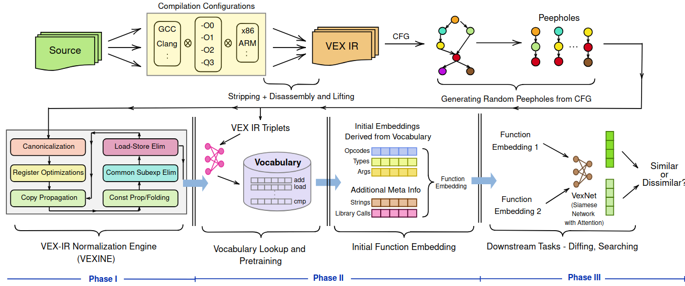

# VexIR2Vec

VexIR2Vec is a robust, architecture-neutral framework for binary similarity, leveraging VEX-IR to overcome challenges from compiler, architecture, and obfuscation variations. It combines peephole-based extraction, normalization, and embedding with a Siamese network.

This repository contains the source code and information described in our [paper](https://dl.acm.org/doi/10.1145/3721481) [(arXiv)](https://arxiv.org/pdf/2312.00507).

You can try out an online demo at https://compilers.cse.iith.ac.in/VexIR2Vec.

> S. VenkataKeerthy, Soumya Banerjee, Sayan Dey, Yashas Andaluri, Raghul PS, Subrahmanyam Kalyanasundaram, Fernando Magno Quintao Pereira, Ramakrishna Updrasta. _"VexIR2Vec: An Architecture-Neutral Embedding Framework for Binary Similarity"_, ACM TOSEM 2025.


<p align="center">
  
</p>


## Table Of Contents
0. [Requirements](#requirements)
1. [Generating Binaries](#generating-binaries)
2. [Generating Initial Embeddings](#generating-initial-embeddings)
3. [Binary Similarity Tasks - Diffing and Searching](#binary-similarity-tasks---diffing-and-searching)
4. [Citation](#citation)
5. [Contributions](#contributions)

## Requirements

> **Base OS:**
> All experiments are conducted on **Ubuntu 20.04**

> **Python Version:**
> Python **3.6.7** is used for running all scripts and experiments.

1. Conda Environment
    For all VexIR2Vec-related workflows, use the Conda environment from [`vexir2vec.yml`](./vexir2vec.yml).
    You can create the environment by doing `conda env create -f vexir2vec.yml`

2. FastText Model
    For the binary similarity tasks a FastText model is required. You can download the model using:
    ```bash
    wget -q https://dl.fbaipublicfiles.com/fasttext/vectors-crawl/cc.en.300.bin.gz -O cc.en.300.bin.gz
    gunzip cc.en.300.bin.gz
    ```

    And, update the FastText model path in the [`utils.py`](./embeddings/vexNet/utils.py#L59).

## Using VexIR2Vec

To carry out diffing and searching experiments described in our paper, you may need to generate data which
involves generating binaries, disassembly and VEX IR extraction followed by generating the embeddings and performing the
task like diffing or searching.

1. [Data generation](#generating-binaries) - Generating binaries, disassembly, VEX IR generaton
2. [Generating the embeddings](#generating-initial-embeddings) - Initial embedding generation (seed embeddings and pretraining), and finetuning with VexNet model.
3. [Binary Similarity Tasks](#binary-similarity-tasks---diffing-and-searching) - Diffing and searching by using the embeddings obtained from the VexNet model.

## Generating Binaries
In our experiments, we consider the binaries generated from `coreutils`, `diffutils`, `findutils`, `lua`, `curl`, `putty`, and
`gzip` projects compiled using different _compilation configurations_:
  - **Compilers**: `Clang` (V6, 8, 12), `GCC` (V6, 8, 10)
  - **Architectures**: `x86`, `ARM`
  - **Compiler Optimizations**: `O0`, `O1`, `O2`, `O3`, `Os`

For further details on binary generation, see the [BinGen directory](./embeddings/BinGen)

## Generating Initial Embeddings
Given the binaries, the initial embeddings are generated as `.data` files using [`driver.py`](./embeddings/pre-training/driver.py).

Each `data` file includes
  - Function `address`
  - `file source` information
  - `function name`
  - Corresponding `embedding` vector

Initial embedding generation for `VexIR2Vec` is supported through two approaches:
- **With Database**: Stores and retrieves processed instruction embeddings and metadata using a structured database backend.
  Ideal for systematic, end-to-end replication of experiments on a large collection of binaries.
- **Without Database**: Processes and uses the binaries directly without relying on persistent storage. Can be used for quick
  generation of embeddings for a binary.
For more details, refer to [Data Generation](./embeddings/pre-training).

`Seed Embeddings`: For training seed embeddings, refer to [seed_embeddings](./vocabulary/seed_embeddings). A pre-trained vocabulary
is [available](./vocabulary/seedEmbedding.txt).

## Binary Similarity Tasks - Diffing and Searching

The task independent initial embeddings are fine-tuned to capture _similarity_ by training `VexNet` model which results in final VexIR2Vec embeddings.
For training details, usage examples, and parameters for `vexir2vec_training.py`, refer to [VexIR2Vec Training](./embeddings/vexNet). A
[trained model](./embeddings/vexNet/vexir2vec.model) is available if you do not want to train a model from scratch.

The final VexIR2Vec embeddings are used to perform similarity tasks like diffing and searching. For more details refer to [Diffing](./experiments/diffing)
and [Searching](./experiments/searching) experiments.


## Citation
```
@article{VenkataKeerthy-2025-VexIR2Vec,
author = {VenkataKeerthy, S. and Banerjee, Soumya and Dey, Sayan and Andaluri, Yashas and PS, Raghul and Kalyanasundaram, Subrahmanyam and Pereira, Fernando Magno Quint\~{a}o and Upadrasta, Ramakrishna},
title = {VexIR2Vec: An Architecture-Neutral Embedding Framework for Binary Similarity},
year = {2025},
publisher = {Association for Computing Machinery},
address = {New York, NY, USA},
issn = {1049-331X},
url = {https://doi.org/10.1145/3721481},
doi = {10.1145/3721481},
journal = {ACM Trans. Softw. Eng. Methodol.},
month = mar,
keywords = {Binary Similarity, Program Embedding, Representation Learning}
}
```
## Contributions
Please feel free to raise issues to file a bug, pose a question, or initiate any related discussions. Pull requests are welcome :)
